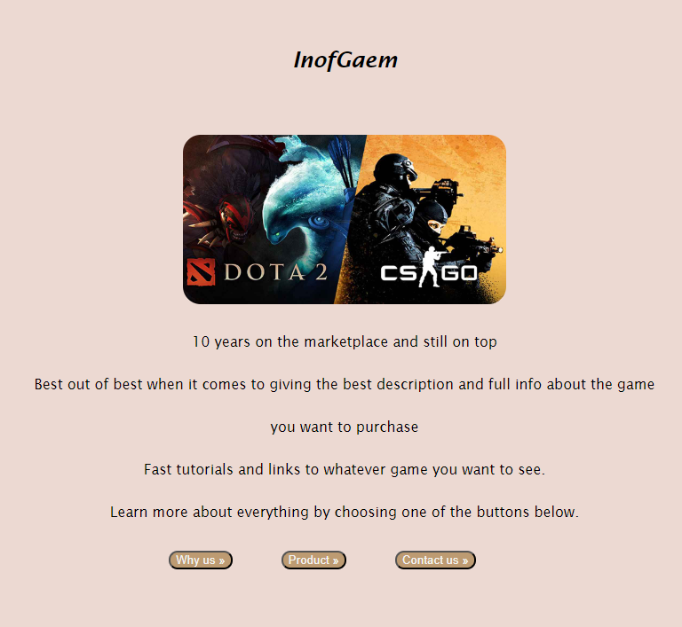
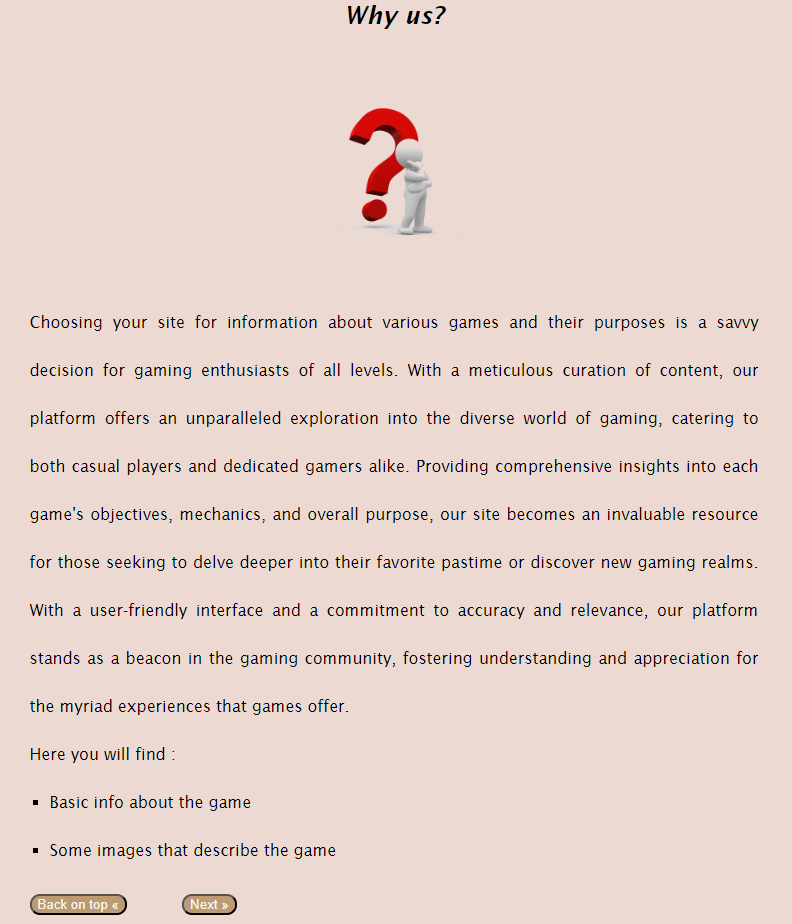
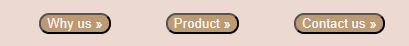
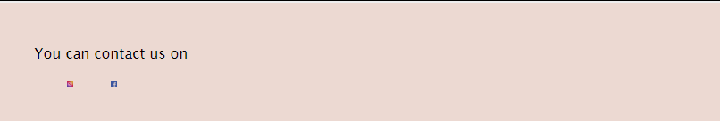

# Laboratory Work No 2

For this laboratory work, I've decided to do a simple site that shows basic info about some games that the user would like to try out. <br>
I've included 4 out of 8 essential sections for the page, and to be precise, these 4 : <br>

- Hero  As you can see here, it is a basic Landing page that should make the user want to use my site. 

- Unique Value Proposion  Again, basic value proposion page, that everyone should write and tell everybody why they're that good and special compared to others.

- Call to Action <br>
   <br>
  CTA is basically buttons that will get you to other parts of the website, or something like a link.

- Contact  This is the well-known contact page, that should have a ton of information, but unfortunately, my website has a very poor contact page, as I have only facebook and instagram.

# Conclusion
Overall, this laboratory work was pretty easy, the main strange part was stylizing buttons and making the page more good looking by using vanilla HTML and CSS.

# Link to live demo
```https://pw-3rdyear.vercel.app/```